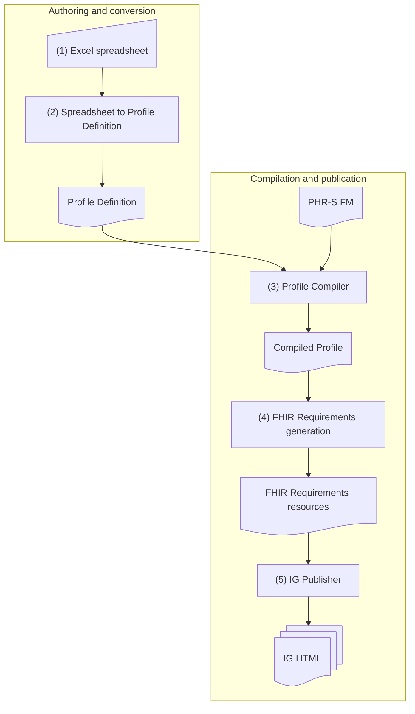

This process describes the end-to-end authoring flow for creating the implementation guide from the source spreadsheet.

1. Source authoring: subject matter experts update the Excel spreadsheet
   - The project team, especially subject matter experts, updates the spreadsheet based on the use cases.
   - They add or adjust functions and criteria from the base PHR-S functional model.
   - Artifact produced: spreadsheet as <i>input</i>.

2. Spreadsheet to MAX ProfileDefinition: an analyst or publishing facilitator runs the spreadsheet-to-MAX conversion
   - The Excel spreadsheet is converted into a MAX ProfileDefinition XML file.
   - This file is the first structured <i>input</i> for the EHRS FM tooling.
   - Artifact produced: MAX ProfileDefinition.

3. MAX Profile Compiler: the analyst runs the MAX Profile Compiler
   - The MAX ProfileDefinition is compiled and validated.
   - During compilation, the relevant base model content is pulled in, including sections, headers, functions, and criteria.
   - Changes and additions from the spreadsheet are applied and marked for downstream use.
   - Artifact produced: MAX compiled profile.

4. FHIR Requirements generation: the compiled MAX file is converted into FHIR Requirements resources
   - A script uses the compiled MAX profile as <i>input</i> and generates FHIR Requirements resource instances.
   - Artifact produced: FHIR Requirements resources.

5. IG publication: the IG Publisher builds the implementation guide
   - The generated Requirements resources and related <i>input</i>s are used by the IG Publisher.
   - The publisher produces the published implementation guide content.
   - Artifact produced: IG HTML.

In short, the workflow is:
Excel spreadsheet -> MAX ProfileDefinition -> MAX compiled profile -> FHIR Requirements resources -> IG HTML.

